# **[Live Demo](http://64.176.218.2:4200)** 
- ### **Link** - http://64.176.218.2:4200

- Test Crendials with some dummy data with expenses for different months: 
    - Username: n@b.com 
    - Password: test123

# Instructions to Run Project

**Note: Please use Node version 20.8.1. If an error occurs, delete `node_modules` and follow the steps again.**

1. Navigate to the server directory:
    ```bash
    cd server
    npm install
    node server.js
    ```


2. Open a new terminal and run the following commands:
    ```bash
    cd personal-budget
    npm install --force
    export NODE_OPTIONS=--openssl-legacy-provider
    ng serve
    ```

# Instructions to Run Test Cases

**Note: A browser popup will appear while running these commands, displaying the test results.**

## Unit Tests

```bash
cd personal-budget
ng test
```
### Unit Test Results
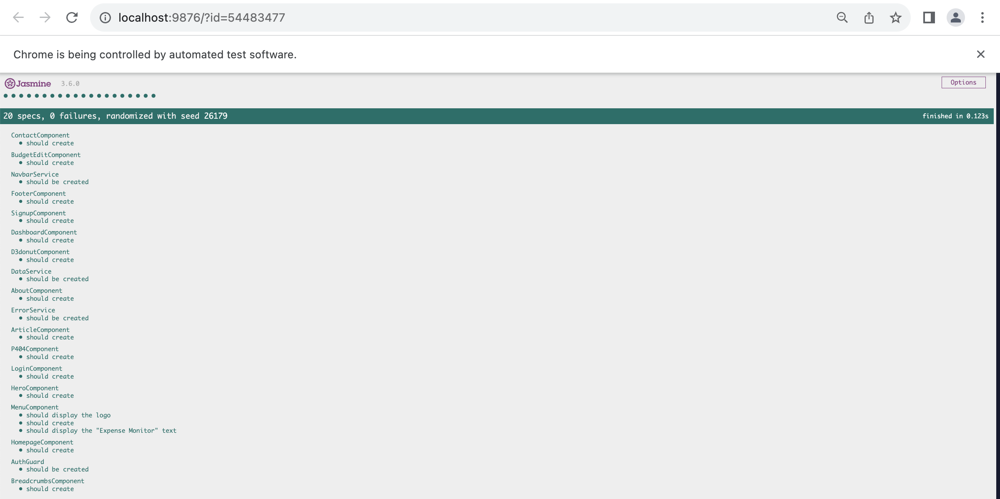

## E2E:
The test cases location can be found at: 

`Nbad-Final-Project/personal-budget/cypress/e2e`.


**Note: For running e2e test case both the backend server i.e. node server.js and ng serve should be up and running.**

```bash
cd personal-budget
export APPLITOOLS_API_KEY=UGT6SGZonA5GCD8mlXSKnifPI1L1BJ2sC2LOAf105pjk4110
npx cypress open
```

After this, a Chrome pop-up will open with the following steps:

1. **Select E2E Testing.**
2. **Choose Chrome as the browser.**
3. **Click the "Start E2E Testing on Chrome" button.**
4. **Select the desired test case to run.**

## Errors those might come:

If you encounter the following error message:
```plaintext
Sorry, we could not load: http://localhost:4200/home
```

1. **Restart both the backend server (node server.js) and the frontend server (ng serve).**
2. **Try running the above commands again. This should resolve the issue.**

If you encounter errors related to cypress installation please run this commands:

```bash
npm install cypress@13.6.1 -f
export APPLITOOLS_API_KEY=UGT6SGZonA5GCD8mlXSKnifPI1L1BJ2sC2LOAf105pjk4110
npx cypress open
```

### E2E Results 
Full screenshots can be found at: 

`Nbad-Final-Project/screenshots/Testing`.

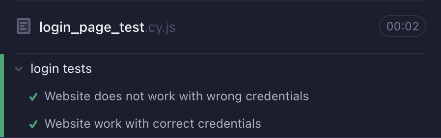

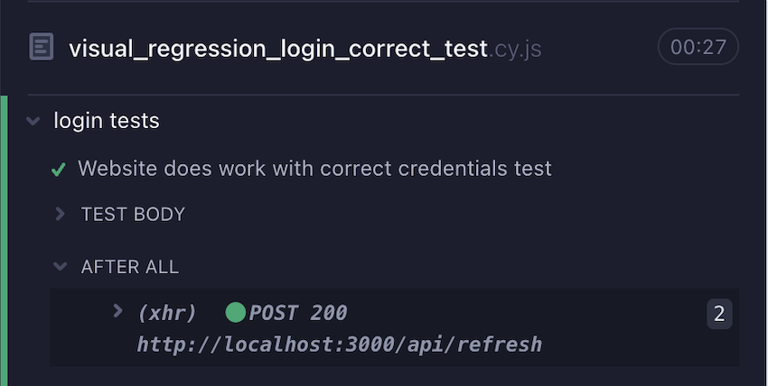

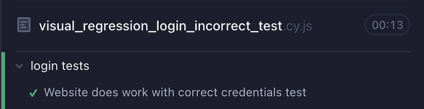

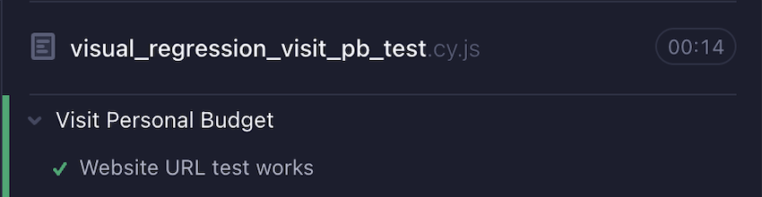

# Screenshots:

### HomePage
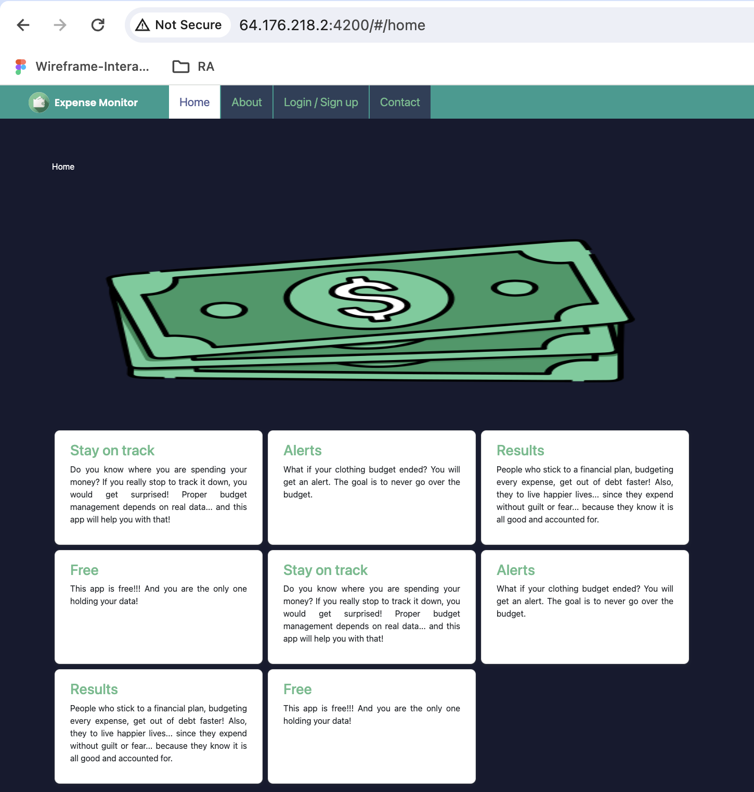

<br>

### AboutPage
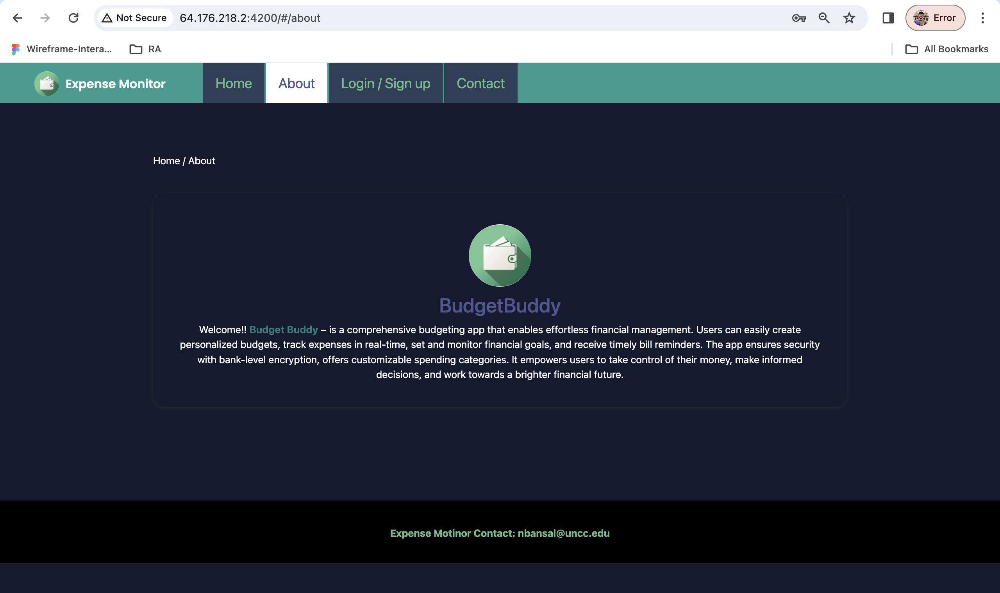

<br>

### Login
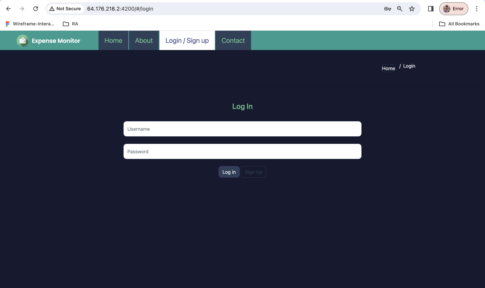

<br>

## Register
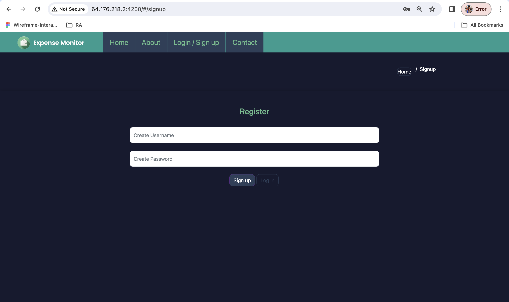

<br>

## Dashboard
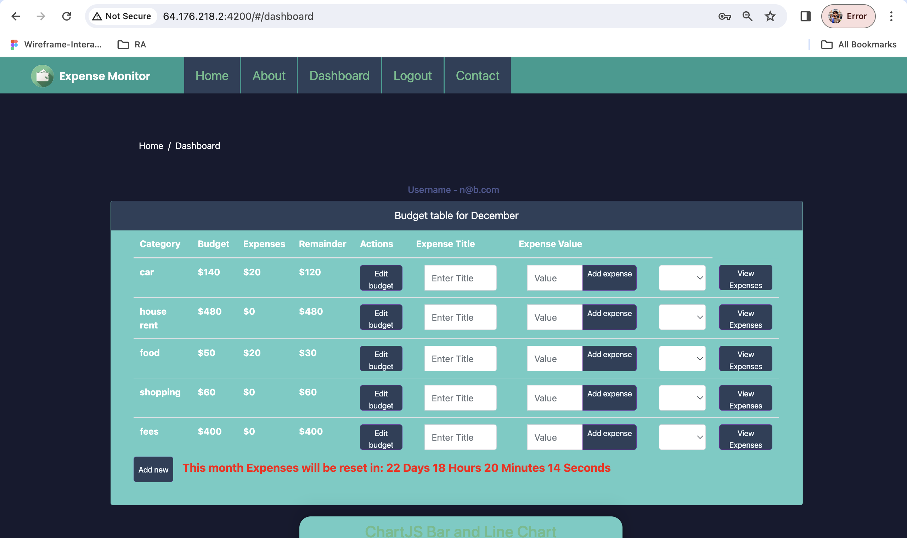

<br>

## Expense Table according to selected month
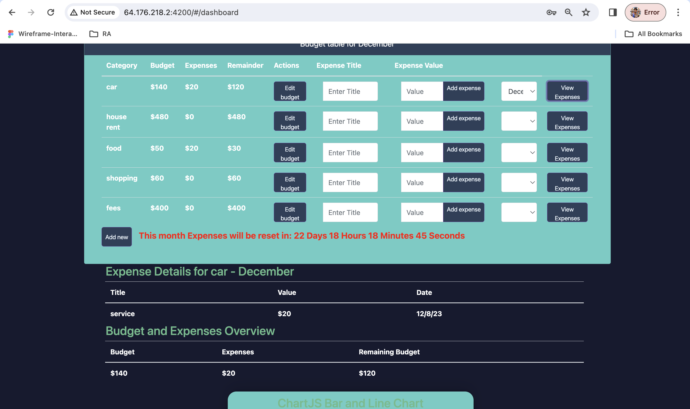

<br>

## Charts
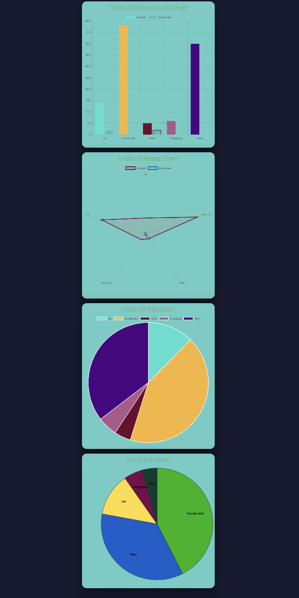

## Alert Box
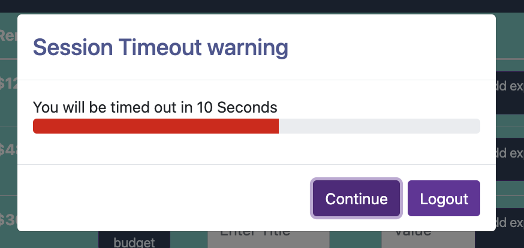

## Contact Page
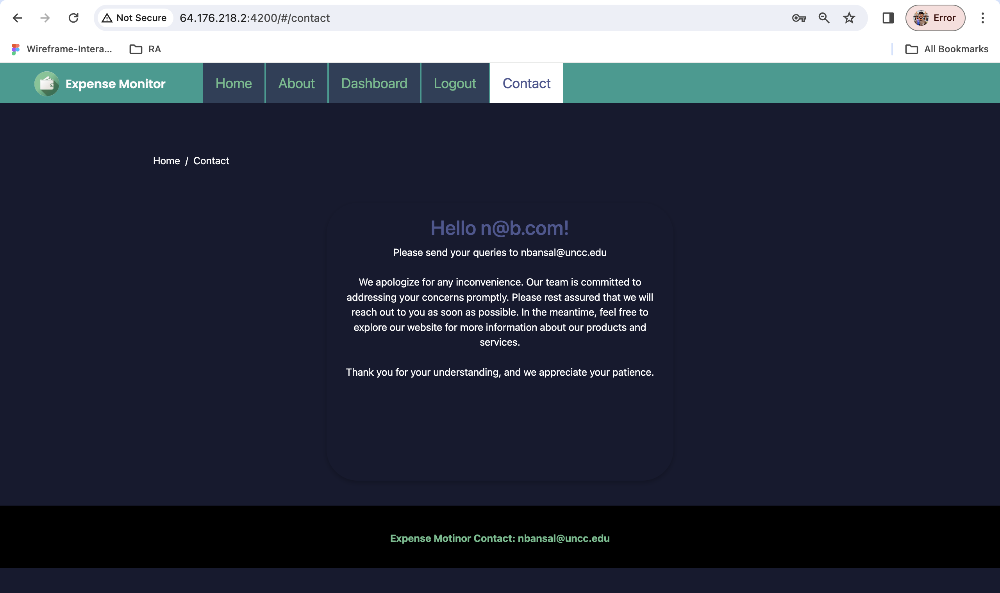
